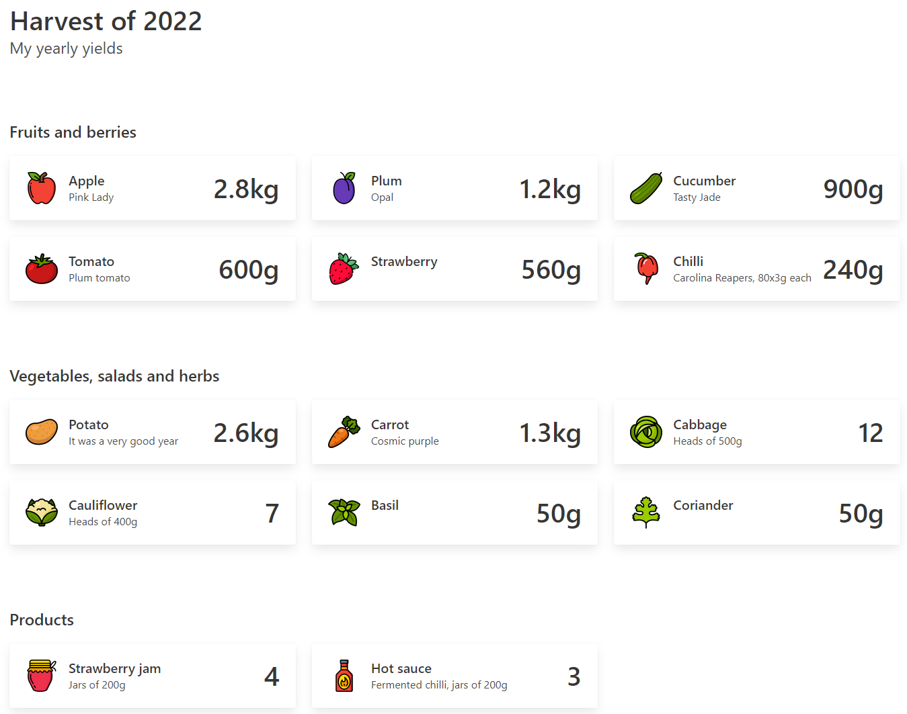

# Yearly yields

Showcase your yearly crop yields from farming or gardening.



## Features

- Works offline, without a webserver
- No installation required
- 90 icons included
- Add your own images
- Easy to modify
- Easy to extend

## How to use

- Add your yields data to data.js
  - name: what is it (title)
  - description: subspecies or other description (subtitle)
  - yield: amount and unit
  - type: can be "fruit", "vegetable" or "product". Berries are fruits
  - icon: filename in icons folder without .png (./icons/***fruit-apple***.png)
  - img: (optional) filename in img folder without .jpg (./img/***apple-tree-1***.jpg)

Example

```js
{
  name: "Apple",
  description: "Pink Lady",
  yield: "2.8kg",
  type: "fruit",
  icon: "fruit-apple",
  img: "apple-tree-1"
},
```

How to find icons that fit in:

1. Go to flaticon.com
2. Search using the "Lineal Color" filter
3. Download as 128x128px PNG file
4. Store it in the icons folder

## Contributing

Don't be afraid to contribute! For now, create an issue if you see room for improvement, and we'll take it from there.
